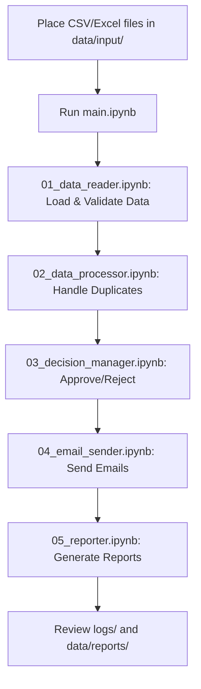

# MSP Application Processing System

## 📁 Project Structure

```
msp_application_system/
├── main.ipynb                    # Main orchestrator notebook
├── config/
│   ├── settings.py              # Configuration settings
│   └── email_templates.py       # Email templates
├── notebooks/
│   ├── 01_data_reader.ipynb     # CSV/Excel reading and validation
│   ├── 02_data_processor.ipynb  # Duplicate handling & conflict resolution
│   ├── 03_decision_manager.ipynb # Approval/rejection logic
│   ├── 04_email_sender.ipynb    # Email automation
│   └── 05_reporter.ipynb        # Logging and reporting
├── utils/
│   ├── __init__.py
│   ├── file_handler.py          # File operations utilities
│   ├── data_validator.py        # Data validation functions
│   └── logger.py               # Logging utilities
├── data/
│   ├── input/                   # Put your CSV/Excel files here
│   ├── processed/               # Processed files
│   └── reports/                 # Generated reports
└── logs/
    └── application_processing.log
```

## 🛠 Core Features

### 1. **Data Reading & Validation**
- Reads multiple CSV/Excel files from input directory
- Handles different file formats and encodings
- Validates required columns (email, name, etc.)
- Creates standardized data structure

### 2. **Duplicate & Conflict Management**
- **Email-based duplicates**: Same email across files
- **Name-based duplicates**: Similar names with different emails
- **Partial duplicates**: Same person, different information
- **Conflict resolution**: Manual review for conflicting records
- **Duplicate reporting**: Detailed logs of all duplicates found

### 3. **Decision Management**
- Automatically creates "Status" column if missing
- Supports multiple decision criteria:
  - Manual approval (you decide)
  - Automatic based on criteria (GPA, year, etc.)
  - Bulk operations
- Tracks decision history and reasoning

### 4. **Email Automation**
- Personalized acceptance emails
- Rejection emails (optional)
- Email templates with placeholders
- Batch sending with rate limiting
- Email delivery tracking and retry logic

### 5. **Comprehensive Reporting**
- Processing summary reports
- Duplicate analysis reports  
- Email delivery status
- Error logs and warnings
- Statistics dashboard

## 🚀 Getting Started

### Prerequisites
```bash
pip install pandas openpyxl xlrd smtplib-ssl jinja2 python-dotenv
```

### Quick Start
1. Place your CSV/Excel files in `data/input/`
2. Configure email settings in `config/settings.py`
3. Run `main.ipynb` and follow the interactive workflow
4. Review reports in `data/reports/`

## 📋 Workflow Overview



## ⚙️ Configuration Options

- **Email providers**: Gmail, Outlook, custom SMTP
- **Duplicate detection sensitivity**: Strict, moderate, lenient
- **Batch processing**: Process files individually or merge all
- **Email scheduling**: Immediate, delayed, or manual trigger
- **Approval criteria**: Manual, automatic, or hybrid

## 🔍 Duplicate Detection Strategy

### Types of Duplicates Detected:
1. **Exact Email Match**: Same email address
2. **Name Similarity**: Fuzzy matching for similar names  
3. **Phone Number Match**: Same phone numbers
4. **Student ID Match**: Same university ID
5. **Cross-File Conflicts**: Same person in multiple files with different data

### Conflict Resolution:
- **Auto-merge**: For minor differences (formatting, etc.)
- **Manual review**: For significant conflicts
- **Latest wins**: Use most recent application
- **Best data**: Combine best information from all sources

## 📊 Expected Output

- **Processed CSV**: Clean, deduplicated data with decisions
- **Email logs**: Who got emailed, when, status
- **Duplicate report**: All duplicates found and how handled
- **Statistics**: Acceptance rates, processing summary
- **Error log**: Any issues encountered during processing
